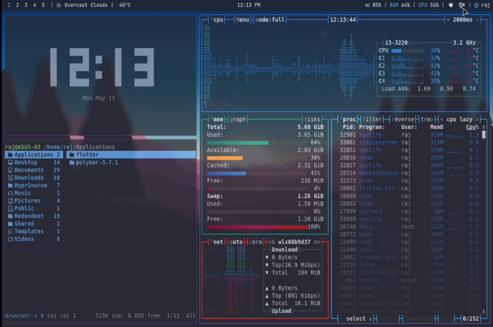

<h1 align="center">My i3wm + picom + rofi dotfiles</h1>

> ### 🛑 DEPRECATED
> This repository has been superseded by [i3wm-dotfiles-v2](https://github.com/Raj-Kashyap001/i3wm-dotfiles-v2). 
> No further updates will be provided.

## Preview



- On Linux Mint 21

## Before You Begin

Before running this script, ensure you have installed the following packages:

- [picom ibhagwan's fork](https://github.com/ibhagwan/picom-ibhagwan-git) for blur effect
- [i3-gaps](https://github.com/Airblader/i3) for window gaps
- Other packages mentioned in the README can be installed via your operating system's package manager.
- You can use normal i3wm and picom but there will be no blur effect or gaps between windows.

Additionally, make sure to have the following fonts installed for icons:

- Font Awesome Icon Font
- Material Design Icon Font
- Jet Brains Mono NF for teminal icons

## Installation Process

`🛑 If by any chance script dont work or you have set up config files on another location then just copy-paste the files in there config folders.`

1. Download or clone the repository to your local machine.

2. Open your terminal and navigate to the directory containing the repository.

3. Make the `install.sh` file executable by running the following command:

   ```bash
   chmod +x install.sh
   ```

4. Run the installation script by executing:

   ```bash
   ./install.sh
   ```

5. The script will copy the configuration files to your `~/.config` directory, creating backups if necessary.

6. Once the installation is complete, your configurations will be applied.

## Additional Information

- If you wish to modify keybindings, note that I've changed the keybinding for quitting windows to Mod+q in i3. You can modify it in the `i3/config` file.

- This script does not copy extra configuration files in TXT or Markdown format.

## Conclusion

That's it! Your configuration files should now be installed and ready to use. If you encounter any issues, feel free to reach out for assistance.

Happy ricing !
